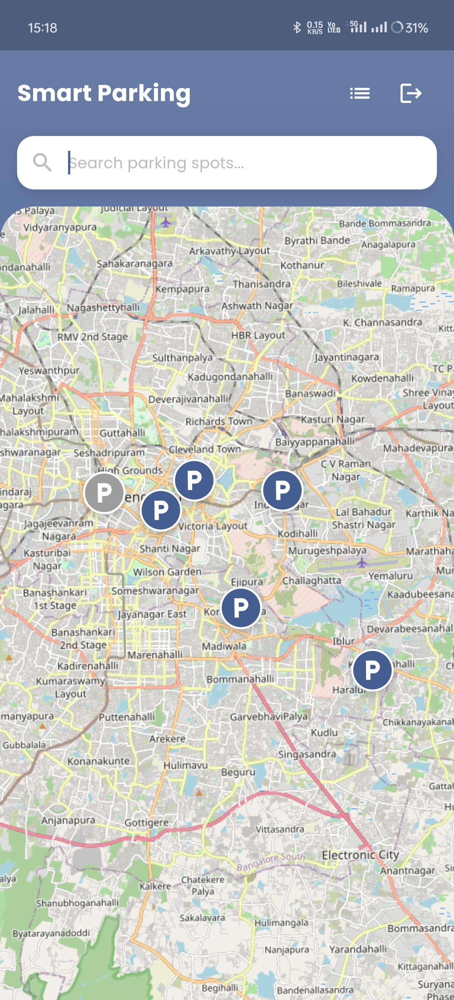

# Park-Ease : Smart Parking Solution

## 🔎 Overview

**Parkease** is a smart parking solution that streamlines the process of finding, booking, and managing parking spaces. It provides real-time parking availability, location details, easy booking options, and secure payments for users, while offering parking space owners efficient tools to manage listings and track bookings.

---

## :sparkles: Features

### For Users
- 🔍 Browse and Book Parking Spaces: Easily find and reserve parking spots in your area.
- 📍 View Real-time Parking Availability: Access real-time information about parking.
- 🎫 QR-based Spot Access and Verification: Use QR codes for seamless entry and exit from parking facilities.
- 💳 Secure Online Payments: Make payments securely through the platform.
- 📅 Manage Bookings: View, modify, and receive instant confirmations for your bookings.
- 📱 Mobile App for On-the-go Access: Use the mobile app to find and book parking spots conveniently.

### For Parking Owners
- 📊 Admin Dashboard: Manage parking listings, monitor bookings, and access real-time data.
- 🔄 Real-time Booking Updates: Stay informed with live updates on bookings and cancellations.
- 📈 Occupancy Statistics: Analyze parking space usage to optimize operations.
- 💰 Revenue Tracking and Analytics: Monitor earnings and analyze financial performance.
- ⛓️‍💥 Offline Booking for Walk-in Customers: Facilitate bookings for customers who arrive without prior reservations.

---

## 🛠️ Tech Stack
### Website (Client & Server)
- **Frontend**: React+Vite, Tailwind CSS, Leaflet Map
- **Backend**: Node.js, Express.js
- **Database**: MongoDB
- **Authentication**: JWT

### Mobile App (Frontend)
- **Framework**: Flutter (Dart)

---

## ⚙️ Installation & Setup

### Prerequisites
- Node.js (v16+)
- MongoDB
- Flutter SDK
- IDE, eg VS Code

## :gear: Steps to Run Locally

### Website (Client)
1. Clone the repository:
    ```bash
    git clone https://github.com/tejaskarade100/smart-parking.git
    cd parkase
    ```
2. Navigate to the `client` folder:
    ```bash
    cd client
    ```
3. Install dependencies :
    ```bash
    npm install
    ```
    (use npm legacy peers if dependencies fail to install)

    ```bash
    npm install --legacy-peer-deps
    ```
4. Run the client:
    ```bash
    npm run dev
    ```

### Website (Server)
1. Navigate to the `server` folder:
    ```bash
    cd server
    ```
2. Install dependencies:
    ```bash
    npm install
    ```
3. Run the server:
    ```bash
    npm run dev
    ```

### App (Mobile : Frontend only)
1. Clone the repository:
    ```bash
    git clone https://github.com/tejaskarade100/smart-parking.git
    cd parkase
    ```
2. Navigate to the `parking_app` folder:
    ```bash
    cd parking_app
    ```
3. Install Flutter dependencies:
    ```bash
    flutter pub get
    ```
4. Run the app:
    ```bash
    flutter run
    ```

---

## :file_folder: Sample `.env` File Structure

```env
# MongoDB Connection (Local or Online)
MONGODB_URI=mongodb://localhost:27017/parkase
DB_NAME=parkase

# JWT Secret for Authentication
JWT_SECRET=your_jwt_secret

PORT=5000
```

---

## 💾 MongoDB Setup

### Local Setup
1. Install MongoDB Community Server
2. Start MongoDB service
3. Use connection string: mongodb://localhost:27017/parkease

### OR

### Cloud Setup (MongoDB Atlas)
1. Create cluster
2. Get connection string
3. Add to .env file

---

## 📸 Demo Screenshots

### Home Page


### User Dashboard


### Booking Interface


### Booking Confirmation


### Admin Dashboard


<div align="center">

## App Screenshots

<!-- First Row: 3 images with spacing -->
<kbd></kbd> &nbsp;&nbsp;&nbsp;&nbsp;&nbsp;&nbsp;
<kbd></kbd> &nbsp;&nbsp;&nbsp;&nbsp;&nbsp;&nbsp;
<kbd></kbd>

<p>
<!--   <strong>Home Page</strong> &nbsp;&nbsp;&nbsp;&nbsp;&nbsp;&nbsp;&nbsp;&nbsp;&nbsp;&nbsp;&nbsp;&nbsp;&nbsp;&nbsp;&nbsp;&nbsp;&nbsp;&nbsp; -->
<!--   <strong>User Dashboard</strong> &nbsp;&nbsp;&nbsp;&nbsp;&nbsp;&nbsp;&nbsp;&nbsp;&nbsp;&nbsp;&nbsp;&nbsp;&nbsp;&nbsp;&nbsp;&nbsp;&nbsp;&nbsp; -->
<!--   <strong>Booking Interface</strong> -->
</p>

<br><br>

<!-- Second Row: 2 images with offset -->
&nbsp;&nbsp;&nbsp;&nbsp;&nbsp;&nbsp;&nbsp;&nbsp;&nbsp;&nbsp;&nbsp;&nbsp;
<kbd></kbd> &nbsp;&nbsp;&nbsp;&nbsp;&nbsp;&nbsp;
<kbd></kbd>

<p>
  &nbsp;&nbsp;&nbsp;&nbsp;&nbsp;&nbsp;&nbsp;&nbsp;&nbsp;&nbsp;&nbsp;&nbsp;
<!--   <strong>Booking Confirmation</strong> &nbsp;&nbsp;&nbsp;&nbsp;&nbsp;&nbsp;&nbsp;&nbsp;&nbsp;&nbsp;&nbsp;&nbsp; -->
<!--   <strong>Admin Dashboard</strong> -->
</p>

</div>

---

## Contributors 🤝

- [Jayesh Lambdade](https://github.com/JayeshL07) (@JayeshL07)
- [Tejas Karade](https://github.com/tejaskarade100) (@tejaskarade100)

---

## 📄 License

This project is licensed under the MIT License - see the [LICENSE](LICENSE) file for details.
